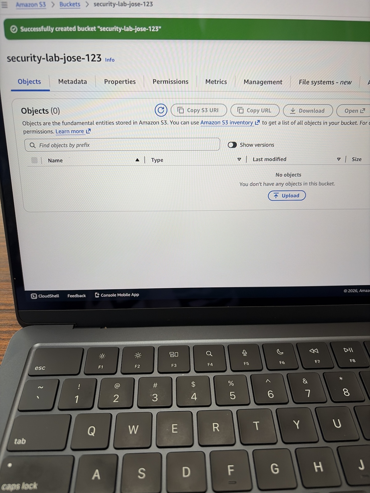
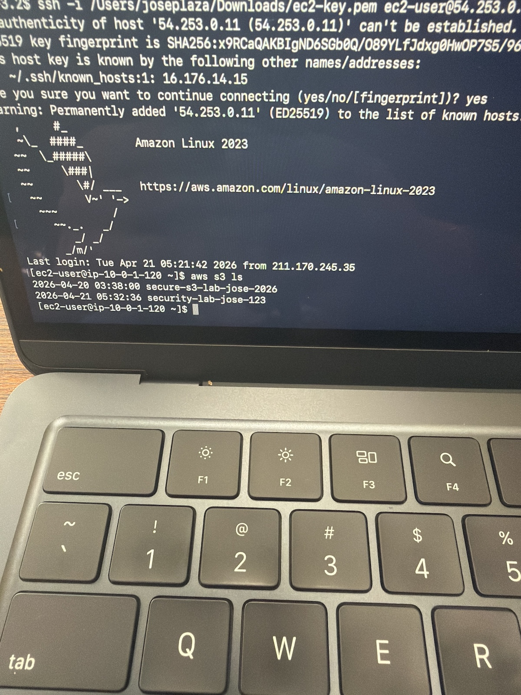
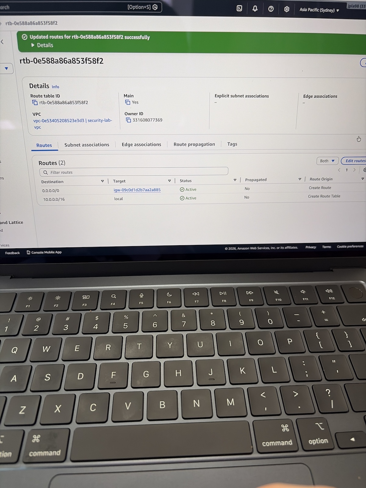

# AWS EC2 to S3 Secure Access Lab

## Overview
This lab demonstrates how to securely configure an EC2 instance to access an S3 bucket using IAM roles, along with VPC networking components such as subnets, route tables, and an Internet Gateway.

## Technologies Used
-AWS EC2
-AWS S3
-IAM Roles
-VPC (Subnets, Route Tables. IGW)
-AWS CLI

## Key Objectives
-Configure secure acess from EC2 to S3 using IAM roles(no hardcoded credentials)
-Build a custom VPC with piblic and private subnets
-Enable internet access via Internet Gateway and route tables
-Validate connectivity using AWS CLI

## Architecture & Proof

### S3 Bucket Created 

### EC2 to S3 Access via CLI

### Subnets (Public & Private)

### Route Table Configuration

### Internet Gateway Attached

## Outcome
Successfully built a secure AWS architecture where an EC2 instance accesses S3 using IAM roles and proper network configuration.

## Skills Demonstrated 
-Cloud Security (IAM roles, least privilege)
-Networking (VPC, subnets, routing)
-Linux & CLI usage 
-AWS architecture design
